# curso-de-sql
curso de sql com  professor bruno cfb curso

######################################################################################################

# chave estrangeira

alter table clientes add constraint fk_tipo_cliente foreign key

(i_tipo_cliente)references tipocliente (i_tipo_tipocliente);

Como funciona foreign key mysql?
A chave estrangeira, ou foreign key, é um conceito ligeiramente diferente.
...
Diferentemente da chave primária, a chave estrangeira:
Pode ser nula (NOT NULL);
É um campo em uma tabela que faz referência a um campo que é chave primária em outra tabela;
É possível ter mais de uma (ou nenhuma) em uma tabela.

sintaxe 
 
 alter table clientes add constraint fk_tipo_cliente foreign key
(i_tipo_cliente)references tipocliente (i_tipo_tipocliente);

# insert dml

## insert

para  inserir uma coluna em uma tabela use 
### alter table cliente add column i_tipo_cliente int not null

para inserir um dado em uma coluna use

## insert into "nome da tabela" values ("aqui insira os valores que serão adicionados na mesma ordem da coluna");

veja os exemplos abaixo

/*
insert into tipocliente values (01,"pessoa fisica");
insert into tipocliente values  (02,"pessoa juridica");
insert into tipocliente values (03,"cliente especial");
*/

/*
insert into cliente values (01,"mariscleia","11111111111","2000-12-20",01);
insert into cliente values (02,"jurinalva","11111111113","2000-11-20",03);
*/

caso seja adicionado um dado em uma coluna especifica basta especificar a coluna antes do parametro "values"

######################################################################################################

# Alterando nome da coluna 

ALTER TABLE nomes_clientes 
RENAME COLUMN primeiro_nome TO nome, 
RENAME COLUMN segundo_nome TO sobrenome;

#como ver essee dados que foram inseridos ?

para isso usaremos DQL (data query language)

## select

select * from ("nome da tabela);

usar o (" * ") significa pegar todas as colunas dentro da tabela
para especificar a coluna basta apenas substituir o * pelo numero da coluna

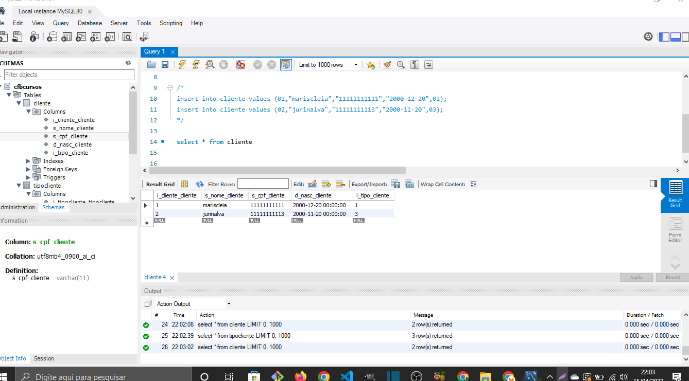

######################################################################################################

# fazendo inserção multipla

para fazer uma inserção multipla voce precisa usar inser em conjunto com o select 

insert into cliente2 (i_cliente_cliente,s_nome_cliente,s_cpf_cliente,d_nasc_cliente,i_tipo_cliente)
select 
i_cliente_cliente,
s_nome_cliente,
s_cpf_cliente,
d_nasc_cliente,
i_tipo_cliente

from cliente2

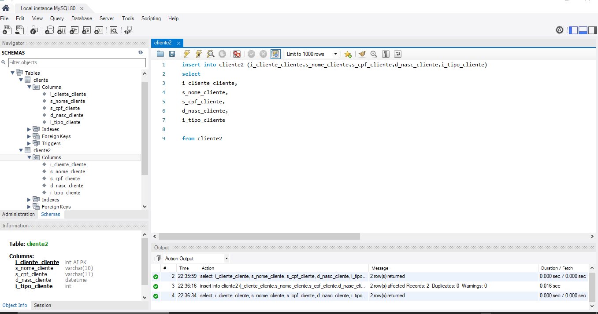

######################################################################################################

# update 
é usado para modifcar registros de uma coluna

update cliente set s_nome_cliente="lauricio" where i_cliente_cliente=1;

######################################################################################################

# delete 
para deletar use a sintaxe 

delete from cliente where i_cliente_cliente > 0

para deletar um registro especifico basta usar as condições

######################################################################################################

# select 

voce pode selecionar quais registros ver e para isso use a sintaxe

select upper(s_nome_cliente),s_cpf_cliente from cliente 

como voce pode ver acima voce pode passar mais de um registro como parametro apos o select ;

######################################################################################################

# alias 

é uma forma de dar apelidos aos registros afim de facilitar as buscas e o uso nas funções

para usar o alias use a sintaxe

select s_nome_cliente as nome_dos_clientes from cliente 

voce tambem pode na mesma sintaxe atribuir um nome a tabela
para isto basta adicionar logo apos o nome da tabel o nome apelido(alias)
e lembre-se de voltar ao nome da coluna e atribuir o nome alias e ponto como no exemplo abaixo

select tbc.s_nome_cliente as nome_dos_clientes from cliente tbc

######################################################################################################

# distinct

serve para remover registros duplicados de uma coluna
para isso use a sintaxe 

select distinct i_cliente_cliente from cliente 

######################################################################################################

# subselect 

trata-se da possibilidade de adicionar operações como um parametro de um insert 
veja a sintaxe a baixo ;

operação:

select max(c.i_cliente_cliente)+1 as i_cliente_cliente from cliente c

esta opéração acia será passada como um parametro de uma inserção veja a seguir

insert into cliente values (select max(
    c.i_cliente_cliente)+1 as i_cliente_cliente from cliente c,
    "lauricio de souza","09871232135","2010-03-01",4);
 )
<<<<<<< HEAD

 ##     INNER JOIN 

 trata se a da possibilidade de adicionar em uma consulta a junção de uma coluna que estaja em outra tabela;

;

tambem podemos fazer varios inner jois na mesma consulta 
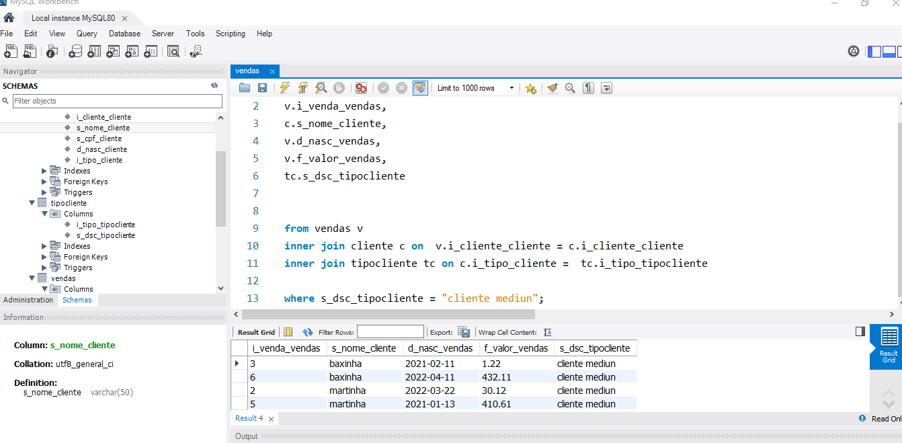;

######################################################################################################

# group by

trata se da possibilidade de agrupar registros que se repetem 
e atraves da função count mostrar a quantidade

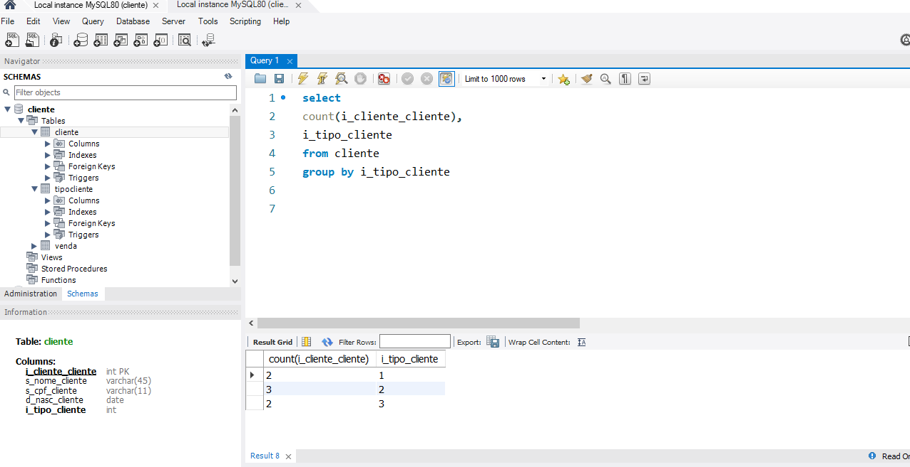;

atenção isso é importante;

adicionando inner join

select 
count(i_cliente_cliente) as qtd,
s_desc_tipocliente
from cliente
inner join tipocliente on i_tipo_tipocliente = i_tipo_cliente
group by i_tipo_cliente

reversão do join 

select 
tc.s_desc_tipocliente,
count(c.i_cliente_cliente) as qtd
from
tipocliente as tc
inner join cliente c on tc.i_tipo_tipocliente  = c.i_tipo_cliente
group by tc.i_tipo_tipocliente

######################################################################################################

# group by 

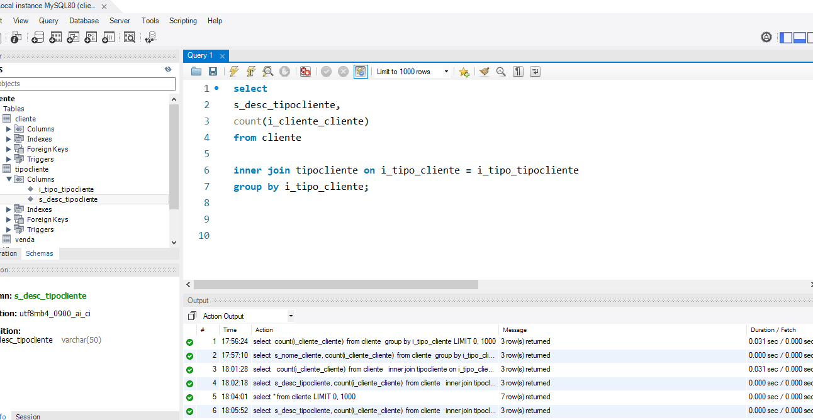;

######################################################################################################

# modelos de entidade e relacionamento

o  modelo de entidade e relacionamento e usado para a criação de bancos de forma mais rapida e eficiente e temdo uma melhor visão 

ex;

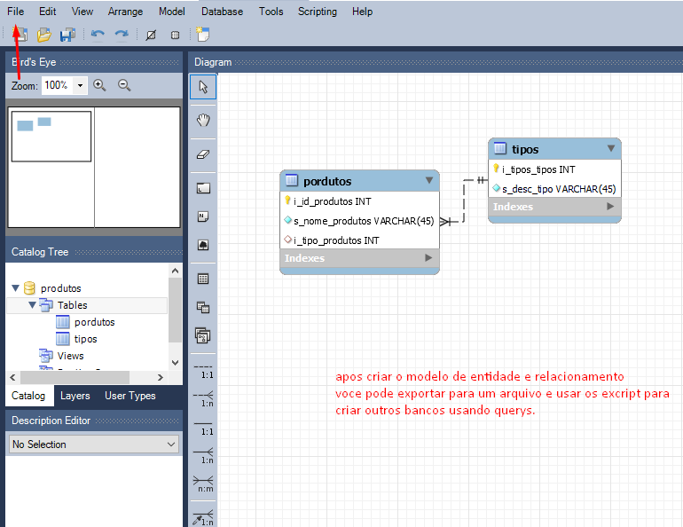

### como na foto voce pode criar varios modelos e depois exportar o escript para 
criar outros bancos usando queryes  
veja o exemplo abaixo;

# passo 01
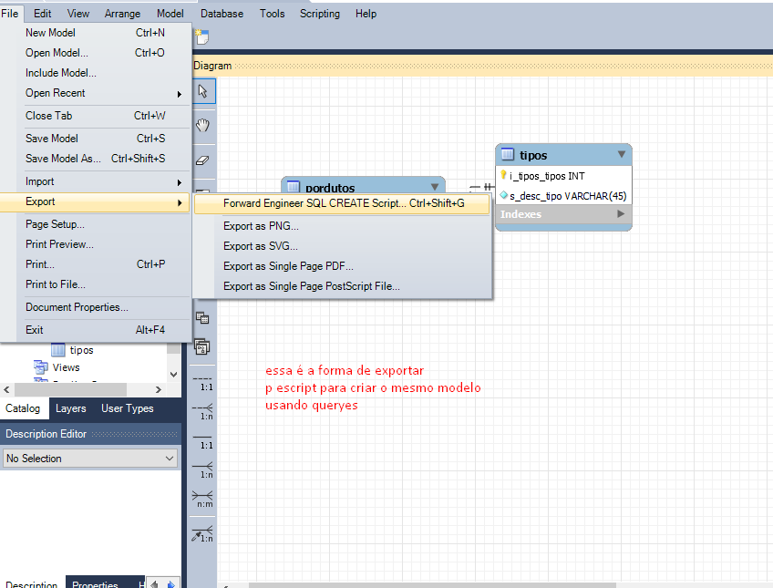]

# passo 02

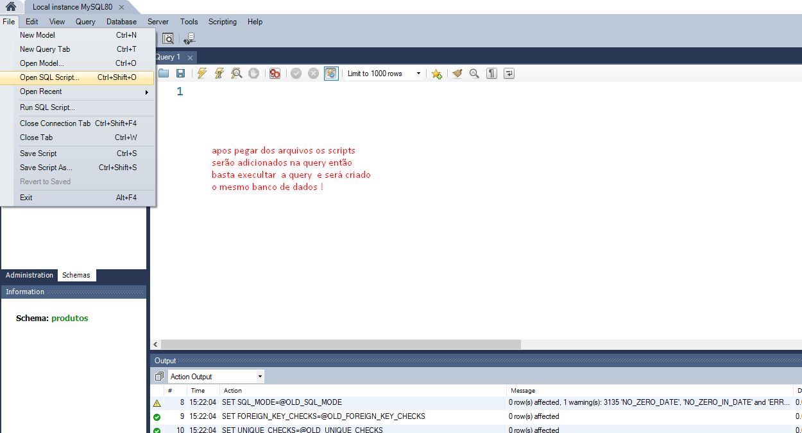

#####################################################################################################

 # null VS is not null

usaremos esses dois tipos de dados quando precisar-mos informar
que um dado é vazio ou diferente de vazio

isso é muito usado para fazer requisições

exemplo: Digamos que em um tabela eu tenha uma coluna com varios registros
e entre eles alguns vazios (null). Então para filtrar em uma consulta apenas os registros
vazios usamos  a seguinte sintaxe.

### select * from clientes 

### where d_nasc_clientes IS NULL ;

"lembre-se ao direcionar uma tabela ao tipo de registro em uma consulta nao usa-se o sinal de igualdade apenas o IS NULL"

  agora imagine que fosse o oposto e você precisa-se filtrar apenas os registro que estivessem preenchidos.

então meu caro neste caso você deve usar o 

 ### is not null 

isso iria indicar que é diferente de vazio

######################################################################################################

# AND, OR e NOT

## AND 
Através dessa tag podemos passar mais de uma condição em nossas consultas
imagine que você prcise  filtrar em uma consulta os que sejam do plano basico e que também tenha a data de
vencimento  no mes 09.

é nesta situação em usamos o " AND " pois ele ira permitir que possamos passar mais de uma condição

e aqui vai uma detalhe muito importante !!!

### para que a pesquisa traga o resultado ambas as condições devem ser verdadeiras!

## OR 
Este é bem facil de lidar pois é muito semelhante ao a tag vista acima oque muda é apenas o fato
de que a nossa consulta feita com "OR" trara resultados mesmo se uma das condições nao for cumprida

então ele funcionará da seguinte forma: 
 digomamos que você queira filtrar pelo id do cliente maior que 10 e tambem se o campo data esta nullo.

 então voce deve usar o "or" da seguinte forma.

 ### select * from clientes 
 ### where  i_id_cliente > 10 OR d_data_cliente IS NULL;

 então esta seria a consulta. Como primeira instacia de resutado ele iria passar todos os id's de clientes 
 que fossem maior que dez e logo apos esses resultados ele iria mostrar os campos de datas que estivessem vazios.

 nao a limites para o uso de condições 
 é possivel  fazer com que condições acontecam antes
 usando parentese nas condições que deverão ser execultadas antes

 veja na imagem a seguir

 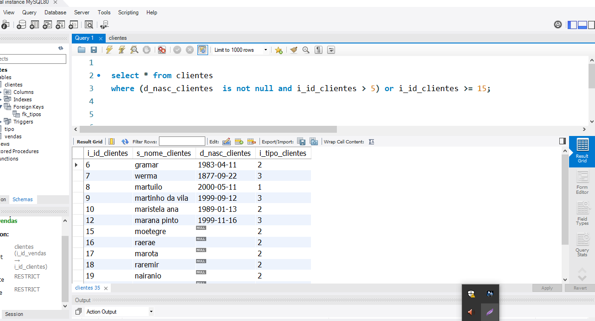

 ## NOT
 Trata-se da negação de um determinado registro 
 digamos que voce precise de alguma forma filtrar uma data todos os clientes menos 
 os que tenha cadatro no mes 09;

 para fazemos essaconsulta usamos a seguinte sintaxe

### select * from clientes
### where  NOT mont(d_data_cliente) = 09;

na sintaxe acima estou informando que quero todos os clientes menos aqueles 
que tenha cadastro no mes 09;

######################################################################################################

# TOP vs LIMIT

Usamos para limitar osresultados de nossas consultas
essa é uma sintaxe que varia muito de acordo com a linguagem e banco de dados 
então deixarei aqui as duas formas relacionadas ao que estou estudando, que é
 MYsql e sql server.

## MYSQL
usamos a seguinte sintaxe:
### select * from clientes limit 5

a sintaxe acima resultará em uma consulta limitada aos 5 primeiros registros

## SQL SERVER
### select top 5, * from clientes

a sintaxe acima resultará em uma consulta limitada aos 5 primeiros registros

######################################################################################################

# max e min

com esses operadores podemos obter os valores maximos e minimos de uma coluna 
sintaxe:   
max(nome_da_coluna)

min(nome_da_coluna)

######################################################################################################

# funções ROUND, SUM, AVG, COUNT

## ROUND 
com ele podemos arredondar numeros quebrados 
sintaxe 

round("nome_coluna",2)

acima o numero apos a virgula significa a quantidade 

de casas decimais apos o virgula no valor retornado.

## SUM 
podemos realzar somos de registros de uma mesma tabela

sintaxe:

sum("nome_coluna")

## AVG (average)
serve para obter a media de valores passados em uma consulta

sintaxe:

avg("nome_coluna")

### OBS:

todas as funções acima podem ser passados 
como paramaretro de outra 
exemplo:

select avg(sum("nome_coluna")) from clientes

select round(avg(sum("nome_coluna")),2) from clientes

######################################################################################################

# LIKE

o operador like serve para apurarmos nossoas consultas de forma mais 
especifica.

atraves dele pode filtrar pela quantidade de caracteres e tambem pelo
proprip caractere ;

## obs:
usamos o " % " para indicar que o caracterwe apos pode ser qualquer um
  
exemplos:

1_   select s_nome_cliente from clientes 
where nome_coluna like("A%")

2_ select s_nome_cliente from clientes 
where nome_coluna like("%A")

acima no exemplo 1 estou dizendo em nossa consulta
que quero filtrar apenas valores que comecem com a letra "A";

acima no exemplo 2 estou dizendo em nossa consulta
que quero filtrar apenas valores que terminam com a letra "A";

## obs:

usamos o " _ " para indicar a quantidade de caracters em nossa consulta
exemplo: 

select s_nome_cliente from cliente where like("_____")

acima estou informando em minha consulta que quero apenas os registros que tenham 
5 caracteres;

######################################################################################################

# usando o operador IN

esse operador serve para sermos mais especificos em nossas consultas
dispensando o uso do and ;

## exemplo digamos que eu tenha que fazer uma consulta que retorne apenas os 3 ultimos caracteres de um cpf 

 veja abaixo o uso do IN para esta consulta;

 select * from clientes 
 where right(s_cpf_clientes,3) in (111,222,333)

 a consulta acima deve me retornar apenas  os cpfs de clientes que tenham como ultimos tres numeros 1,2 ou 3 .

 ### OBS: podemos tambem passar subselects como parametro de um IN  

######################################################################################################

# between 

com ele podemos fazer consultas que irão retornar valores que estejam entre determinadascondições ;
ex:
## digamos que eu tenha que filtar em uma consulta valores que estejam entre 1 e 5 entao para esta consulta iria usar a seguinte sintaxe;

select * from clients 
where i_id_clientes between 1 and 5;

isso iria retornar clietes de id 1 A 5;

# Between
Trata-se de uma forma de simplificar o uso do in 
ao inves de epecificar todos os numeros que queremos como retorno
passamos apenas o primeiro e o ultimo sinalizando que os resultados estarãoentre os numeros
passados.

exemplo:

select * from clientes
where i_id_cliente between 1 and 10

### dessa forma estou especificando que o retorno estará entre 1 e 10;

######################################################################################################

# tipos de join

## inner join 
irá pegar apenas registro em comumn entre duas tabelas

## left join 
irá dar prioridade apenas a tabela principal

### obs :
na consulta com left join será retornado valores que nao tem nehum vinculo com
com valores relacionado.

## rigth join 

irá dar prioridade a tabela secundaria

##  Full outer join irá retornar todos os valores de ambas as tabelas 

### obs : 
para que possa ser usado antes deve existir um join entre as tabelas

## Self join

trata-se de filtrar registros em consultas tendo como base ela mesma;

exemplo;

select * from clientes c1 ,clientes c2 
where  c1.i_tipo_clients = c2.i_tipo_clientes 
order by i_tipo_clientes;

lembre-se de usar o "alias"  para diferenciar a tabela usada na consulta.

######################################################################################################

# union

permite juntar mais de um select e gerar um resultado

no exemplo abaixo veja a junção de duas colunas
que tem registros em comun 

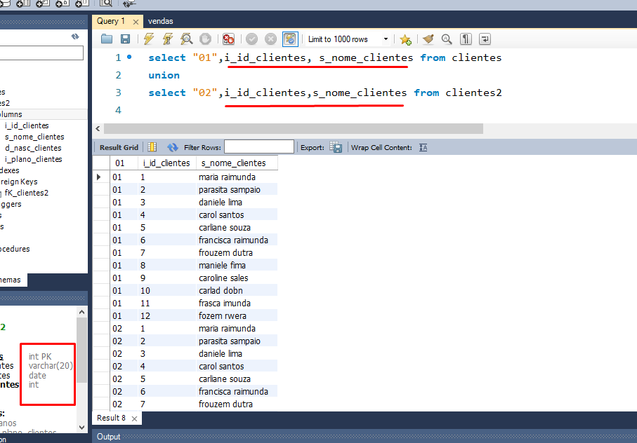

## exemplo 

select "col 01",i_id_clientesm, s_nome_clientes 
from clietes
UNION
select "col 2", i_id clientes, s_nome_clientes from clientes 

## obs:

é possivel fazer  mais  de 2 union na mesma consulta.
e a quantidade de colunas e a ordem delas devem ser as mesmas
e dessa forma será possivel juntar diferentes colunas em apenas uma consulta;
 

######################################################################################################

# exists

com ele podemos aprimorar mais nossos filtros em uma consulta 
basicamente estamos usamos uma consulta como condiçao se esta condição retornar true 
então sera exibidos os resultados correspondentes
veja abaixo como usar o operador exists.

select * from clientes where
exists (select * from vendas where i_cliente_vendas = i_id_clientes);

## obs:

as colunas envolvidas na consulta que foi passado como condiçao devem ter um relacionamento
de chave estrangeira.
;

######################################################################################################

# case when
com ele podemos passar condições e ações em nossas consultas
e obter colunas dinamicas com os registros retornados

exemplo:
se o valor da coluna data for nulo enâo atribua a data atual;

sintaxe da consulta acima;

select 
case

when d_data_cliente is null them now()
else d_data_clientes

end

veja o exemplo abaixo;

#ifnull
serve para adicionar valores em registros que tenham valores nullos 
e em detetminadas situações precisamos que esses valor nullo seja substituido;

######################################################################################################

## situação: 

digamos que eu precise calcular os valores de produtos e quantidade
de vendas feitas.
nesse caso precisamos que mesmo que esse produto nao tivesse nenuma venda
tenha como valor o "0" assim sera possivel realizar operações.

sintaxe;

select * , round(valor_produto * ifnull(quantidade,0),2) as "total" from vendas;

resumo sintaxe>: 
ifnull(coluna, "numero que devera substituir o nullo");

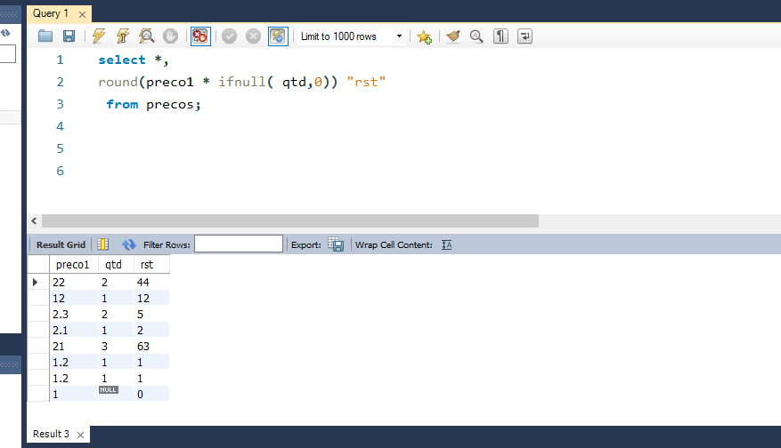

######################################################################################################

# procedures 
são consultas avancadas que podemos armazenar e usar quando nescessario

para criar uma procedure use a seguinte sintaxe;

delimiter ##
 create procedure teste()

 begin

 declare n varchar(24);
 set n = "texto de exemplo";
 select  n.

end ##

delimiter ;

para chamar uma procedure use a sintaxe abaixo;

call teste();

## usando procedures com parametros

uma procedure pode resceber parametros que serão utilizados 
para retornar valores em nossoas consultas.

exemplo :

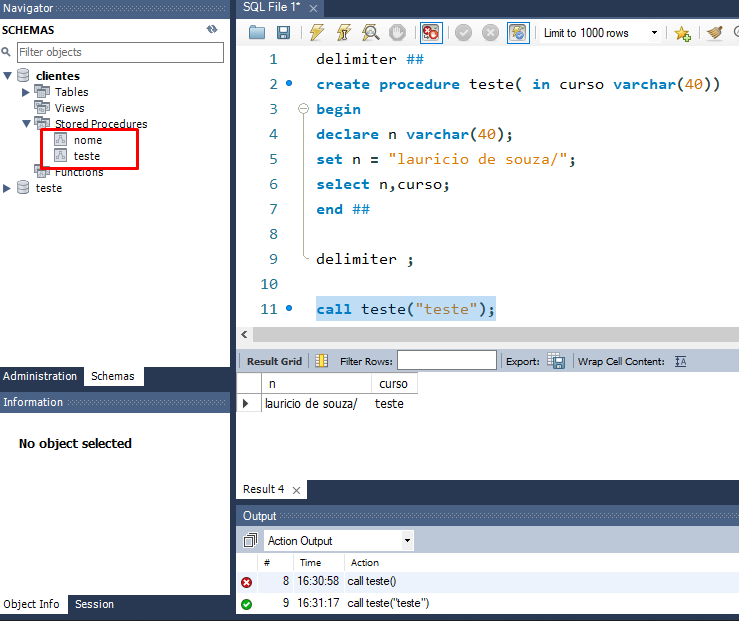;

obs: caso nao seja passado a quantdade correta de parametros a cunsulta ira retornar um erro;
